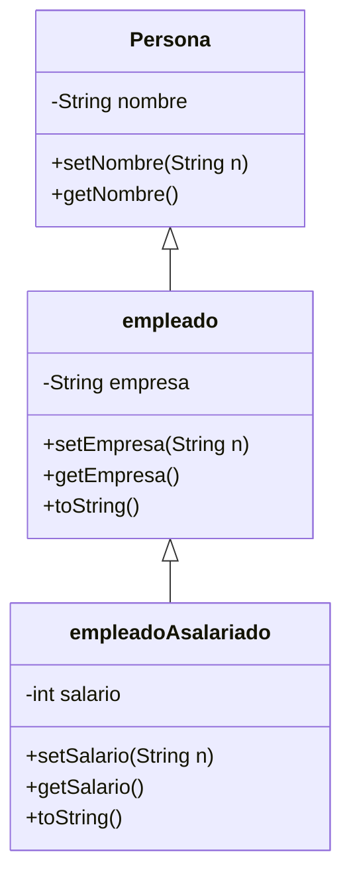

# Diagrama de clases y herencia

```mermaid
classDiagram
    class Persona {
        -String nombre
        +setNombre(String n)
        +getNombre()
    }
    class empleado {
        -String empresa
        +setEmpresa(String n)
        +getEmpresa()
        +toString()
    }
    class empleadoAsalariado {
        -int salario
        +setSalario(String n)
        +getSalario()
        +toString()
    }

    Persona <|-- empleado
    empleado <|-- empleadoAsalariado
```
