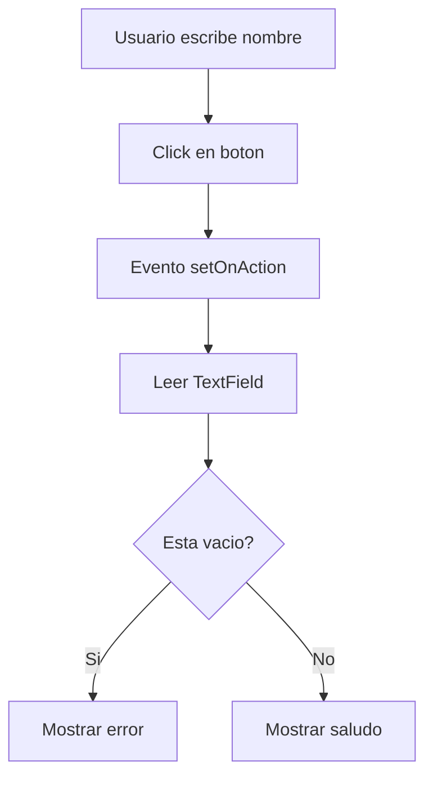

# Aplicación

## Flujo Interno del Programa

---

## Mejoras Futuras

### Puedes agregar

- CSS
- Imágenes
- Menús
- TableView
- Bases de datos
- Login
- Animaciones
- Gráficas científicas
- Simulaciones físicas

---

## JavaFX y Física

JavaFX es excelente para:

- Simulaciones numéricas
- RK4
- Ecuaciones diferenciales
- Visualización de órbitas
- Gráficas interactivas
- Simuladores de mecánica
- Interfaces científicas
