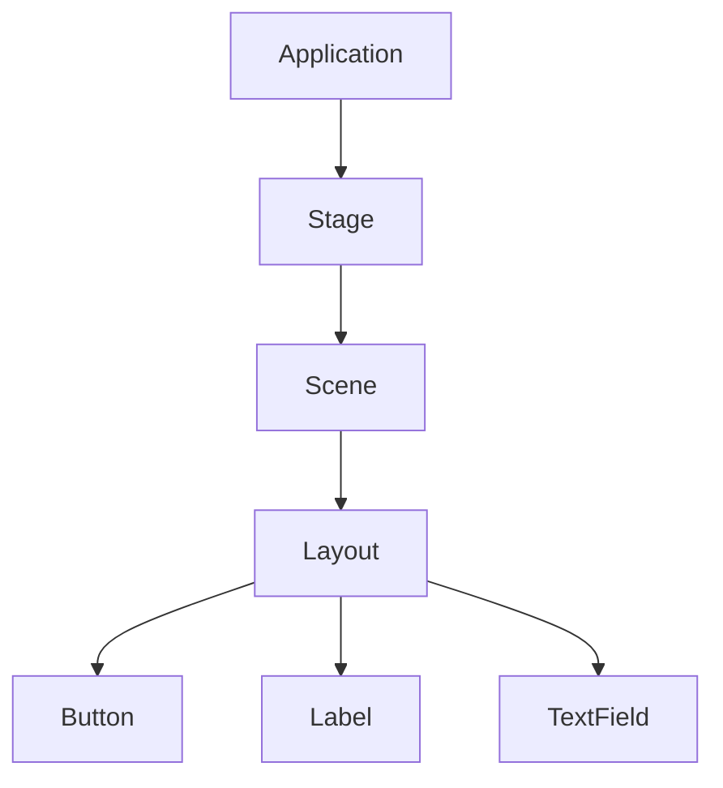
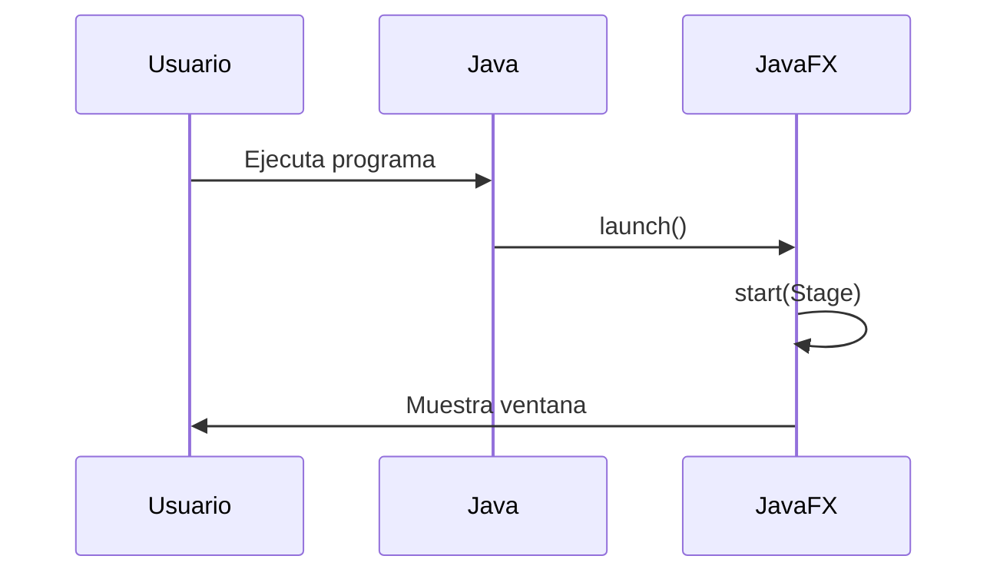
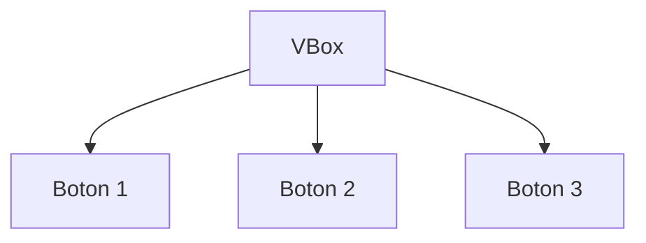
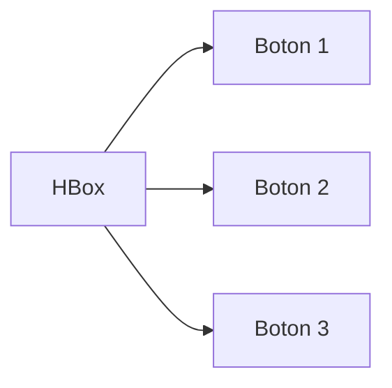
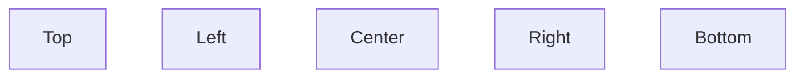
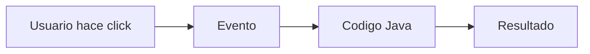
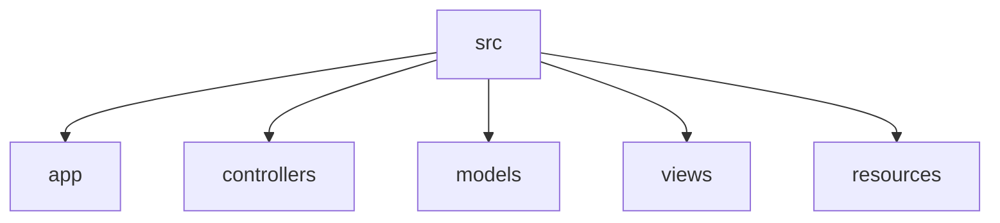
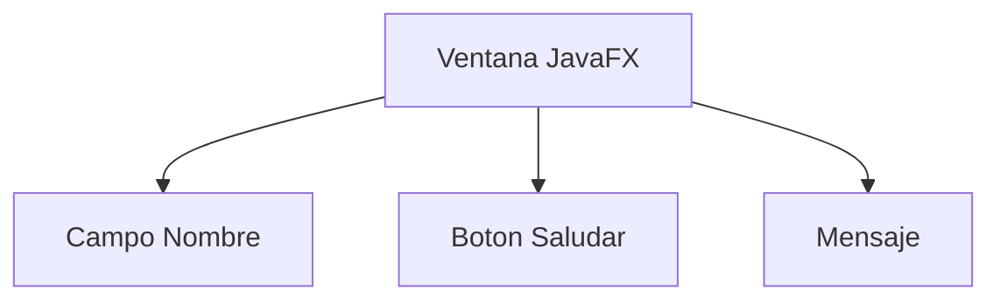

# Guía Completa de JavaFX en VSCode

## ¿Qué es JavaFX?

JavaFX es un framework gráfico para Java que permite crear aplicaciones de escritorio modernas.

Con JavaFX puedes crear:

- Interfaces gráficas
- Sistemas administrativos
- Simuladores
- Juegos simples
- Dashboards
- Herramientas científicas
- Aplicaciones interactivas

---

## Arquitectura Básica de JavaFX



---

## Componentes Fundamentales

| Componente | Función |
| --- | --- |
| Application | Clase principal |
| Stage | Ventana |
| Scene | Contenido visual |
| Node | Elemento gráfico |
| Layout | Organizador de componentes |

---

## Flujo de Ejecución



---

## Primer Programa JavaFX

```java
import javafx.application.Application;
import javafx.scene.Scene;
import javafx.scene.control.Button;
import javafx.stage.Stage;

public class Main extends Application {

    @Override
    public void start(Stage stage) {

        Button boton = new Button("Hola JavaFX");

        Scene scene = new Scene(boton, 400, 300);

        stage.setTitle("Mi Primera App");
        stage.setScene(scene);
        stage.show();
    }

    public static void main(String[] args) {
        launch();
    }
}
```

---

## Explicación del Programa

### Extender Application

```java
public class Main extends Application
```

Permite convertir la clase en una aplicación JavaFX.

---

### Método start()

```java
public void start(Stage stage)
```

Es el punto de inicio gráfico.

Aquí se crea toda la interfaz.

---

### Crear Componentes

```java
Button boton = new Button("Hola JavaFX");
```

Crea un botón.

---

### Crear Scene

```java
Scene scene = new Scene(boton, 400, 300);
```

- Primer parámetro → contenido
- Segundo → ancho
- Tercero → alto

---

### Mostrar Ventana

```java
stage.show();
```

Hace visible la aplicación.

---

## Layouts en JavaFX

Los layouts organizan automáticamente los componentes.

### VBox

Organiza verticalmente.



---

### HBox

Organiza horizontalmente.



---

### BorderPane



---

## Ejemplo con VBox

```java
import javafx.application.Application;
import javafx.scene.Scene;
import javafx.scene.control.Button;
import javafx.scene.layout.VBox;
import javafx.stage.Stage;

public class Main extends Application {

    @Override
    public void start(Stage stage) {

        Button b1 = new Button("Boton 1");
        Button b2 = new Button("Boton 2");

        VBox root = new VBox();

        root.getChildren().addAll(b1, b2);

        Scene scene = new Scene(root, 400, 300);

        stage.setScene(scene);
        stage.show();
    }

    public static void main(String[] args) {
        launch();
    }
}
```

---

## Eventos

Los eventos permiten reaccionar a acciones del usuario.



---

## Ejemplo de Evento

```java
boton.setOnAction(e -> {
    System.out.println("Click detectado");
});
```

---

## Controles Más Utilizados

| Control | Uso |
| --- | --- |
| Button | Botón |
| Label | Texto |
| TextField | Campo de texto |
| TextArea | Área grande de texto |
| PasswordField | Contraseña |
| CheckBox | Casilla |
| ComboBox | Lista desplegable |
| TableView | Tablas |

---

## CSS en JavaFX

JavaFX soporta CSS.

## Archivo CSS

```css
.button {
    -fx-background-color: blue;
    -fx-text-fill: white;
    -fx-font-size: 16px;
}
```

---

## Cargar CSS

```java
scene.getStylesheets().add("style.css");
```

---

## FXML

FXML permite separar:

- Diseño
- Lógica

---

### Ejemplo FXML

```xml
<VBox>
    <Button text="Hola"/>
</VBox>
```

---

## Scene Builder

Scene Builder es un editor visual para JavaFX.

Permite:

- Arrastrar componentes
- Diseñar ventanas
- Generar FXML automáticamente

---

## Instalación de JavaFX en VSCode

### Paso 1 — Instalar Java

Se recomienda JDK 17 o superior.

Verificar:

```bash
java --version
```

---

### Paso 2 — Instalar VSCode

Instalar:

- VSCode
- Extension Pack for Java
- Debugger for Java
- Maven for Java

---

### Paso 3 — Descargar JavaFX SDK

Descargar desde OpenJFX.

Ejemplo:

```text
C:/javafx-sdk-24
```

---

## Configuración launch.json

```json
{
    "version": "0.2.0",
    "configurations": [
        {
            "type": "java",
            "name": "Launch JavaFX",
            "request": "launch",
            "mainClass": "Main",
            "vmArgs": "--module-path C:/javafx-sdk-24/lib --add-modules javafx.controls,javafx.fxml"
        }
    ]
}
```

---

## Estructura Profesional



---

## Aplicación Completa de Ejemplo

## Objetivo

Crear una aplicación sencilla que:

- Use botones
- Use labels
- Use textfields
- Maneje eventos
- Tenga comentarios educativos
- Sirva para estudiar JavaFX

---

## Resultado Esperado



## Conclusión

JavaFX es una herramienta moderna y poderosa para construir aplicaciones de escritorio en Java.

Dominar JavaFX permite desarrollar:

- Aplicaciones profesionales
- Interfaces modernas
- Herramientas científicas
- Sistemas administrativos
- Simuladores interactivos

Es especialmente útil para estudiantes de programación, ingeniería y física.
